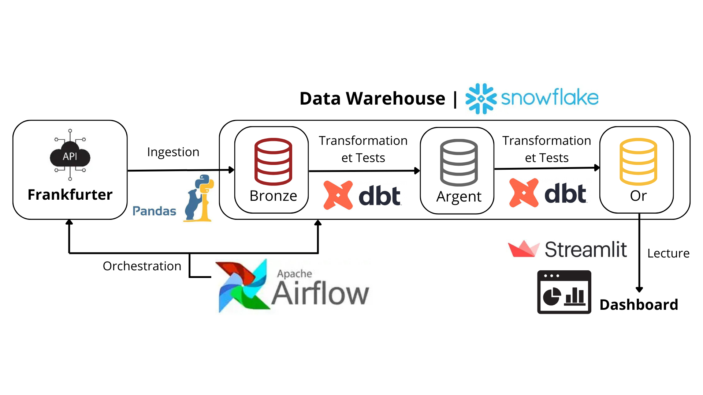
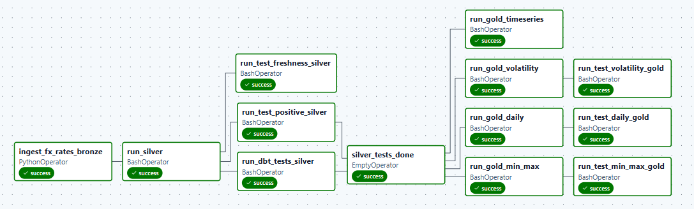

# FX Market Data Platform – Documentation

## 1. Architecture & flux de données

Le projet met en place un pipeline data complet pour l'analyse de taux de change.

Flux principal :
- Ingestion des données FX depuis l'API Frankfurter
- Stockage brut en Bronze dans Snowflake
- Transformation en Silver et Gold avec dbt
- Orchestration quotidienne via Airflow
- Visualisation via Streamlit

Technologies principales :
- Python (ingestion avec Pandas, dashboard avec Streamlit)
- Snowflake (data warehouse)
- dbt (transformations, tests)
- Airflow (orchestration)

## 2. Modélisation des données (Bronze / Silver / Gold)

Le modèle suit une architecture médaillon :

- **Bronze** : données brutes JSON, historisées avec timestamp d'ingestion, non transformées.
- **Silver** : données normalisées (1 ligne = 1 devise, 1 jour).
- **Gold** : tables analytiques orientées usage :
  - dernier taux par devise et variation par rapport au dernier taux (en %)
  - min / max historiques (4 dernières semaines)
  - volatilité sur 7 jours
  - historique (30 derniers jours) pour graphique

## 3. Orchestration & qualité

Airflow orchestre les différentes étapes du pipeline.

Des tests sont implémentés avec dbt :
- unicité et non-nullité des clés
- fraîcheur des données (pour le monitoring)
- cohérence des valeurs (taux positifs)

Les échecs de tests bloquent la suite du pipeline.

## 4. Visualisation

Une application Streamlit permet d'explorer les données relatives aux taux de change
de manière simple et interactive.

Objectifs :
- suivre l'évolution récente d'une devise
- analyser les variations journalières
- comparer la stabilité des devises

Fonctionnalités :
- sélection de la devise (USD, GBP, JPY)
- affichage du dernier taux disponible
- variation journalière en pourcentage
- volatilité calculée sur les 7 derniers jours (utile pour évaluer la stabilité)
- graphique d'évolution du taux sur 30 jours

Les données proviennent des tables Gold.

## 5. Limites & améliorations

Limites actuelles :
- Environnement unique : absence de séparation entre les environnements de développement et de production.
- Ingestion batch manuelle : le pipeline est déclenché depuis GitHub Codespaces et nécessite une action manuelle.
- Monitoring basique : supervision via l'interface Airflow (UI).

Axes d'amélioration:

- Séparation DEV / PROD : mise en place de targets dbt distincts avec des jeux de données dédiés.
- Multiples profils Snowflake : utilisation de rôles, schémas et bases différents pour les environnements DEV et PROD.
- Exécution sur infrastructure dédiée : déploiement du pipeline sur une machine virtuelle ou un serveur afin d'assurer une exécution continue.
- Conteneurisation avec Docker : packaging du projet (Airflow, dbt, ingestion) pour garantir la reproductibilité et faciliter le déploiement.  
  *Non implémenté dans ce projet en raison des limitations liées aux droits administrateur.*
- Alerting automatique : mise en place d'alertes (email) via Airflow en cas d'échec des tests de qualité des données, notamment pour les tests de fraîcheur des données.

